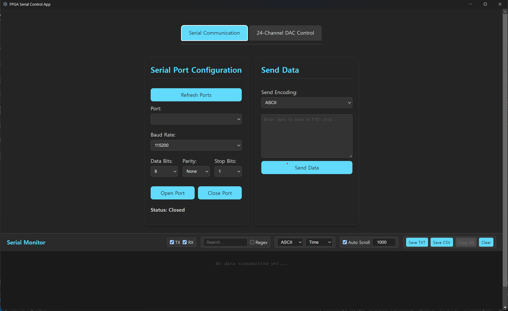

# Device Control App

A modern desktop application built with **Electron** and **React** for controlling FPGA devices via serial communication. Features include real-time serial port communication, 24-channel DAC control, and an advanced serial monitor with filtering and export capabilities.

## 📸 Screenshots


*Main interface showing serial communication and DAC control tabs*

## 🚀 Features

### Serial Communication
- **Multi-port Support**: Automatic detection and connection to available serial ports
- **Flexible Configuration**: Support for various baud rates (300-921600), data bits, parity, and stop bits
- **Multiple Encodings**: ASCII, UTF-8, UTF-16LE, UCS2, Base64, Binary, and HEX support
- **Real-time Communication**: Bidirectional data transmission with live status updates

### 24-Channel DAC Control
- **Multi-channel Management**: Control up to 24 DAC channels simultaneously
- **Flexible Resolution**: Support for both 12-bit (0-4095) and 16-bit (0-65535) DAC resolution
- **Batch Operations**: Set all channels at once or control individual channels
- **Real-time Updates**: Send commands instantly or batch send all enabled channels

### Advanced Serial Monitor
- **Real-time Logging**: Live display of transmitted (TX) and received (RX) data
- **Multiple Display Formats**: ASCII, HEX, and Binary data visualization
- **Advanced Filtering**: Filter by TX/RX, search with regex support
- **Flexible Timestamps**: Absolute time, relative time, or milliseconds display
- **Data Export**: Save logs as TXT or CSV files
- **Selection & Copy**: Multi-select entries and copy to clipboard
- **Auto-scroll Control**: Optional automatic scrolling to latest entries

### Application Features
- **Auto-updates**: Built-in update mechanism for seamless software updates
- **Modern UI**: Responsive design with dark theme
- **Tab-based Interface**: Organized workflow with separate tabs for different functions
- **Error Handling**: Comprehensive error handling and user feedback
- **Cross-platform**: Windows support with potential for macOS and Linux

## 📋 Prerequisites

- **Node.js** 18.0.0 or higher
- **npm** 8.0.0 or higher
- **Windows** (primary support), macOS/Linux (potential support)

## 🛠️ Installation

### For Development

1. **Clone the repository**
   ```bash
   git clone https://github.com/yourusername/device-control-electron-app.git
   cd device-control-electron-app-new
   ```

2. **Install main dependencies**
   ```bash
   npm install
   ```

3. **Install React app dependencies**
   ```bash
   cd device-control-app
   npm install
   cd ..
   ```

4. **Run in development mode**
   ```bash
   npm run dev
   ```
   This will start both the Vite development server and Electron concurrently.

### For Production

1. **Build the React application**
   ```bash
   npm run build-renderer
   ```

2. **Start the Electron app**
   ```bash
   npm start
   ```

3. **Build distributable packages**
   ```bash
   npm run build-all
   ```

## 📂 Project Structure

```
device-control-electron-app-new/
├── main.js                 # Electron main process
├── preload.js             # Electron preload script (security layer)
├── package.json           # Main package configuration
├── assets/                # Application assets
│   └── FPGA_Icon.ico     # App icon
├── device-control-app/    # React frontend application
│   ├── src/
│   │   ├── App.jsx       # Main React component
│   │   ├── App.css       # Styling
│   │   ├── main.jsx      # React entry point
│   │   └── index.css     # Global styles
│   ├── package.json      # React app dependencies
│   └── vite.config.js    # Vite configuration
└── release/              # Build output directory
```

## 🔧 Configuration

### Serial Port Settings
- **Baud Rate**: 300, 600, 1200, 2400, 4800, 9600, 14400, 19200, 28800, 38400, 57600, 115200, 230400, 460800, 921600
- **Data Bits**: 7, 8
- **Parity**: None, Even, Odd, Mark, Space
- **Stop Bits**: 1, 2
- **Encoding**: ASCII, UTF-8, UTF-16LE, UCS2, Base64, Binary, HEX

### DAC Control Protocol
The application sends DAC commands in the following format:
```
DAC,<channel>,<value>\n
```
- `<channel>`: Channel number (1-24)
- `<value>`: DAC value (0-4095 for 12-bit, 0-65535 for 16-bit)

## 🖥️ Usage

### Serial Communication
1. **Connect Device**: Select your serial port from the dropdown
2. **Configure Settings**: Set baud rate, data bits, parity, and stop bits
3. **Open Port**: Click "Open Port" to establish connection
4. **Send Data**: Type your data and click "Send Data"
5. **Monitor Activity**: View real-time communication in the Serial Monitor

### DAC Control
1. **Set Resolution**: Choose between 12-bit or 16-bit DAC resolution
2. **Configure Channels**: 
   - Enable/disable individual channels
   - Set values using sliders or number inputs
   - Use "Set All Channels" for batch configuration
3. **Send Commands**: 
   - Send individual channel commands
   - Send all enabled channels at once

### Serial Monitor Features
- **Filter Data**: Toggle TX/RX display, search with text or regex
- **Change Format**: Switch between ASCII, HEX, and Binary display
- **Export Data**: Save logs as TXT or CSV files
- **Select & Copy**: Multi-select entries and copy to clipboard

## 🔄 Auto-Update

The application includes built-in auto-update functionality:
- Automatically checks for updates on startup
- Downloads updates in the background
- Notifies users when updates are available
- Provides manual update checking option

## 🛠️ Development Scripts

```bash
# Development mode (React + Electron)
npm run dev

# Build React app only
npm run build-renderer

# Start Electron app (production mode)
npm start

# Build for distribution (Windows)
npm run build

# Build for all platforms
npm run build-all

# Clean build files
npm run clean

# Clean everything including node_modules
npm run clean-all

# Rebuild from scratch
npm run rebuild
```

## 📦 Dependencies

### Main Dependencies
- **electron**: Desktop app framework
- **serialport**: Serial communication library
- **electron-updater**: Auto-update functionality
- **electron-log**: Logging system

### Development Dependencies
- **electron-builder**: Build and packaging tool
- **concurrently**: Run multiple commands simultaneously
- **rimraf**: Cross-platform rm -rf

### React App Dependencies
- **react**: UI library
- **react-dom**: React DOM renderer
- **vite**: Build tool and development server

## 🔐 Security

The application implements Electron security best practices:
- **Context Isolation**: Enabled for security
- **Node Integration**: Disabled in renderer process
- **Preload Script**: Secure API exposure between main and renderer processes
- **Content Security Policy**: Implemented for web security

## 🤝 Contributing

1. Fork the repository
2. Create a feature branch (`git checkout -b feature/AmazingFeature`)
3. Commit your changes (`git commit -m 'Add some AmazingFeature'`)
4. Push to the branch (`git push origin feature/AmazingFeature`)
5. Open a Pull Request

## 📝 License

This project is licensed under the MIT License - see the [LICENSE](LICENSE) file for details.

## 🐛 Troubleshooting

### Common Issues

**Serial Port Access Issues**
- Ensure the device is properly connected
- Check if another application is using the port
- Try different USB ports or cables
- Verify device drivers are installed

**Build Issues**
- Run `npm run clean` and rebuild
- Ensure Node.js and npm versions meet requirements
- Delete `node_modules` and run `npm install`

**Development Server Issues**
- Ensure Vite dev server is running on port 5173
- Check for port conflicts
- Try running `npm run dev` instead of `npm start` in development

### Getting Help

- Check the [Issues](https://github.com/yourusername/device-control-electron-app/issues) page
- Create a new issue with detailed error information
- Include system information and steps to reproduce

## 📞 Support

- **Email**: your.email@example.com
- **GitHub Issues**: [Project Issues](https://github.com/yourusername/device-control-electron-app/issues)
- **Documentation**: [Wiki](https://github.com/yourusername/device-control-electron-app/wiki)

## 🏆 Acknowledgments

- Built with [Electron](https://electronjs.org/)
- React frontend with [Vite](https://vitejs.dev/)
- Serial communication via [node-serialport](https://github.com/serialport/node-serialport)
- UI components and styling with modern CSS practices

---

**Made with ❤️ for FPGA developers and hardware enthusiasts**